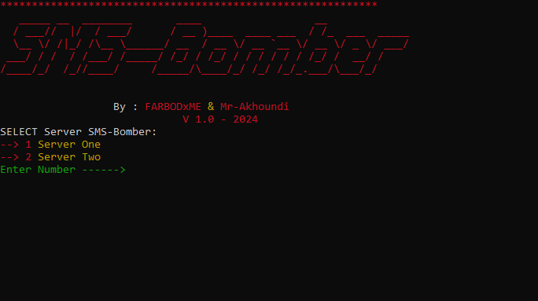

**************************************************************
<h2>SMS - BOMBER 2024</h2>
 

 <h4 align="left">Languages and Tools:</h4> 

 
**************************************************************
<h3>How To Install :</h3>
 
## Open cmd & Terminal :
 
- git clone https://github.com/farbodXme/SMS-BOMBER.git
 
- cd SMS-BOMBER/sms
 
- pip install -r requirements.txt
 
- python main.py
- Set Phone Number With out ---> 0 <---  <h3>Example : ( 901****** )</h3>

<h2>views :</h2>
 

